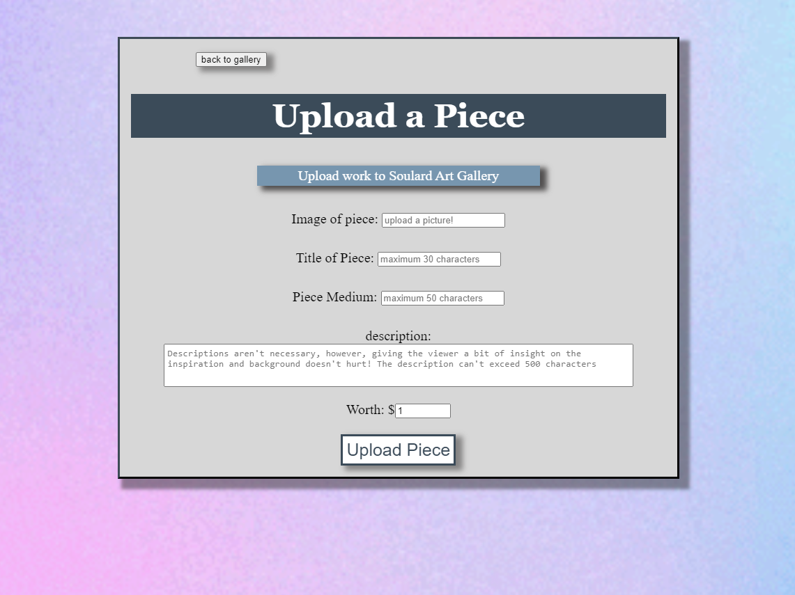

# Art Gallery
a content-sharing app for artists created with Node.js, React, Ruby on Rails, PostgreSQL

## Introduction
---

Art Gallery's primary developmental focus was to practice techniques using back-end models with different types of relationships using PostgreSQL alongside ActiveRecord and a front-end client. 
 
The focus of the front-end client is to render a smooth and seamless UI that 
takes advantage of routing behavior and custom styling.

---
## Technologies

* Node.js 16.5.1
* Ruby 2.7.4p191
* React 18.2.0
* PostgreSQL 1.1
* Rails 6.1.6.1
---
## Launch
To launch and use the application run these commands in the project root folder:

```
$ bundle install

$ npm install --prefix client
```

run the backend server on  http://localhost:3000:
```
$ rails s
```
open a separate terminal to run the front end on http://localhost:4000:
```
$ npm start --prefix client
```
galleries can not be created using the app but rather contain gallery seed data in the db/seeds.rb file. To run the seed data:
```
$ rails db:seed
```
*note*: without any gallery data, a user will not have the ability to create content(pieces). The seeds.rb file can be altered to contain different data if the user chooses, but it is impossible to create galleries from within the client.


### link to heroku version: https://art-gallery-1.herokuapp.com/
---
## Project Status

The project currently has a User, Piece, and Gallery model. Potential updates for Art Gallery will contain the following:

* On the client users can leave comments on pieces. Individual pieces will contain the ability to post a comment and list all comments. The back-end will contain a comment model

* Users can like other pieces. The client will contain like/unlike functionality as well as total likes.

* On the Piece page, the creator's name will contain onClick() functionality which will navigate to that user's page. The page will contain user profile info and all owned pieces. Pieces will contain onClick() functionality to navigate to the page for clicked piece.
---



### Sources for gif backgrounds

https://gizmodo.com

Gismodo Australia polkadot image - https://www.gizmodo.com.au/2014/06/these-mesmerising-gifs-are-visual-proof-that-maths-can-be-cool/

Gismodo Australia squares image - https://www.gizmodo.com.au/wp-content/uploads/sites/2/2014/06/25/782238561472316964.gif?quality=80&w=660


https://giphy.com

rainbow gradient gif background - https://media0.giphy.com/media/FyoaJE2iah7WYeyxWr/giphy.gif?cid=790b7611303478b560a286c18447b6db6bdd49b7ed52a30b&rid=giphy.gif&ct=g